<div align="center">
  
   
</div>
<div align="center">
  
  
  
  
  
  
</div>

# vagas-frontend

Projeto Opensource que visa melhorar o match entre os profissionais Juniors e empresas. Saiba mais em [SouJunior](https://www.soujunior.tech/).


### Obs. Para colaboradores da organização

> Antes dos passos de instalação do projeto lembre-se sempre de forkar o repositório oficial e só realizar alterações no repositório "forkado" enviando modificações através de Pull Requests.
> Nunca modifique diretamente o repositório oficial(upstream).

## Instalação 🔽

> Nesse projeto é usado apenas o Yarn como gerenciador de pacotes. Para prevenir erros e conflitos com outro package manager (e.g. NPM), recomendamos que também utilize o Yarn. Veja o website oficial do Yarn [aqui](https://yarnpkg.com/).

Clone o projeto

```bash
  git clone https://github.com/SouJunior/vagas-frontend
```

Entre no diretório do projeto

```bash
  cd vagas-frontend
```

Instale as dependências

```bash
  yarn install
```

Configurar as variaveis de ambiente:

VITE_APP_GOOGLE_ANALYTICS_KEY= # GA do SouJunior
VITE_APP_URL= # link do backend
VITE_APP_URL_JOBS= # link da api de jobs

## Rodando localmente ▶

Inicie o servidor

```bash
  yarn start
```

## Usado por 🛰

Esse projeto é usado pela [SouJunior](https://github.com/SouJunior).

## Stack utilizada ⚙

**Framework JavaScript:**
  
**Framework CSS:**
  
**Outras tecnologias:**


  
**Ambiente de desenvolvimento:**


## DevOps

```mermaid
sequenceDiagram
    actor Dev as Desenvolvedores
    participant Git as GitHub
    participant Net as Netlify

    Note over Dev,Net: Fluxo de Deploy com Preview

    Dev->>Git: Abre Pull Request (PR) para main
    Git->>Net: Novo Evento: PR criada
    Net-->>Git: Deploy Preview criado
    
    Note over Dev,Net: Loop de desenvolvimento
    
    Dev->>Git: Aprova e mergeia PR para main
    Git->>Net: Novo Evento: Branch main atualizada
    Net-->>Git: Deploy de Produção atualizado
```



## Relacionados ⚡

[Projeto Vagas - Backend](https://github.com/SouJunior/vagas-backend)


## Autor(es) 🙎🏻‍♂️

-   Max Faria | [GitHub](https://github.com/max-faria) - [Linkedin](https://www.linkedin.com/in/maxfariaa/)
-   Isabela S. Hyeda Buitoni | [GitHub](https://github.com/isabelahyeda) - [Linkedin](https://www.linkedin.com/in/isabelahyeda/)
-   Leonardo Dias Monteiro | [GitHub](https://github.com/Leodias2204) - [Linkedin](https://www.linkedin.com/in/leonardo-dias-monteiro-54642264/)

## Ex-Autor(es) 🙎🏻‍♂️

-   Filipe Reis | [GitHub](https://github.com/FilipeLeoni) - [LinkedIn](https://www.linkedin.com/in/filipe-leoni-5745551a8/)
-   Igor Gonçalves | [GitHub](https://github.com/igords-goncalves) - [Linkedin](https://www.linkedin.com/in/igords-goncalves/)
- João Vitor Kremer | [GitHub](https://github.com/JoaoKremerDev) - [LinkedIn](https://www.linkedin.com/in/joaokremer/)
-   Alberto Santos | [GitHub](https://github.com/allbertuu) - [LinkedIn](https://www.linkedin.com/in/albertov-albuquerque/) - [Portfólio](https://portfolio-allbertuu.vercel.app/)
-   Carlos Junior | [GitHub](https://github.com/CarlosJunioor) - [LinkedIn](https://www.linkedin.com/in/carlosjuniordev/)
-   Rafael Pires | [GitHub](https://github.com/RafaelPires2) - [Linkedin](https://www.linkedin.com/in/rafael-pires-075891212/)
-   Silvia Luiza | [GitHub](https://github.com/SilviaLTeixeira) - [LinkedIn](https://www.linkedin.com/in/silvialuiza/)

## Feedback 💬

Se você tiver algum feedback, por favor nos deixe saber por meio do nosso [site](https://soujunior.tech). Ou fazendo uma [contribuição](#contribuição-).

## Contribuição 💙

Contribuições são sempre bem-vindas!

Veja [`contribuindo.md`](contribuindo.md) para saber como começar.

[Voltar ao 🔝](#vagas-frontend)
